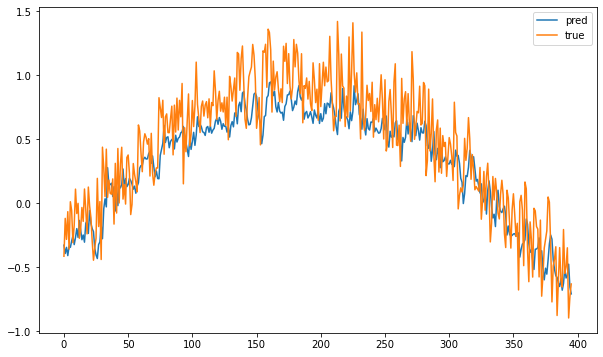
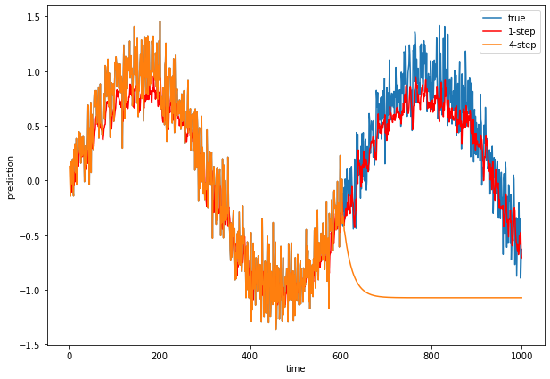

```python
%matplotlib inline
import numpy as np
import pandas as pd
import matplotlib.pyplot as plt
import torch
from torch.utils.data import TensorDataset
from torch.utils.data import DataLoader
import torch.nn as nn
from torch import optim
import torch.nn.functional as F
```


```python
from plotly.subplots import make_subplots
import plotly.express as px
```


```python
T = 1000 # Generate a total of 1000 points
time = torch.arange(1, T + 1, dtype=torch.float32)
x = torch.sin(0.01 * time) + torch.normal(0, 0.2, (T,))
df=pd.DataFrame([time, x]).T
df.columns=["time", "value"]
fig=px.line(df, x="time", y="value", width=400, height=300)
fig.show()
```


<div>


            <div id="fcb4dec0-8ffa-4a11-8891-a4fd134c9f5f" class="plotly-graph-div" style="height:300px; width:400px;"></div>
            <script type="text/javascript">
                require(["plotly"], function(Plotly) {
                    window.PLOTLYENV=window.PLOTLYENV || {};

                if (document.getElementById("fcb4dec0-8ffa-4a11-8891-a4fd134c9f5f")) {
                    Plotly.newPlot(
                        'fcb4dec0-8ffa-4a11-8891-a4fd134c9f5f',
                        [{"hoverlabel": {"namelength": 0}, "hovertemplate": "time=%{x}<br>value=%{y}", "legendgroup": "", "line": {"color": "#636efa", "dash": "solid"}, "mode": "lines", "name": "", "showlegend": false, "type": "scatter", "x": [1.0, 2.0, 3.0, 4.0, 5.0, 6.0, 7.0, 8.0, 9.0, 10.0, 11.0, 12.0, 13.0, 14.0, 15.0, 16.0, 17.0, 18.0, 19.0, 20.0, 21.0, 22.0, 23.0, 24.0, 25.0, 26.0, 27.0, 28.0, 29.0, 30.0, 31.0, 32.0, 33.0, 34.0, 35.0, 36.0, 37.0, 38.0, 39.0, 40.0, 41.0, 42.0, 43.0, 44.0, 45.0, 46.0, 47.0, 48.0, 49.0, 50.0, 51.0, 52.0, 53.0, 54.0, 55.0, 56.0, 57.0, 58.0, 59.0, 60.0, 61.0, 62.0, 63.0, 64.0, 65.0, 66.0, 67.0, 68.0, 69.0, 70.0, 71.0, 72.0, 73.0, 74.0, 75.0, 76.0, 77.0, 78.0, 79.0, 80.0, 81.0, 82.0, 83.0, 84.0, 85.0, 86.0, 87.0, 88.0, 89.0, 90.0, 91.0, 92.0, 93.0, 94.0, 95.0, 96.0, 97.0, 98.0, 99.0, 100.0, 101.0, 102.0, 103.0, 104.0, 105.0, 106.0, 107.0, 108.0, 109.0, 110.0, 111.0, 112.0, 113.0, 114.0, 115.0, 116.0, 117.0, 118.0, 119.0, 120.0, 121.0, 122.0, 123.0, 124.0, 125.0, 126.0, 127.0, 128.0, 129.0, 130.0, 131.0, 132.0, 133.0, 134.0, 135.0, 136.0, 137.0, 138.0, 139.0, 140.0, 141.0, 142.0, 143.0, 144.0, 145.0, 146.0, 147.0, 148.0, 149.0, 150.0, 151.0, 152.0, 153.0, 154.0, 155.0, 156.0, 157.0, 158.0, 159.0, 160.0, 161.0, 162.0, 163.0, 164.0, 165.0, 166.0, 167.0, 168.0, 169.0, 170.0, 171.0, 172.0, 173.0, 174.0, 175.0, 176.0, 177.0, 178.0, 179.0, 180.0, 181.0, 182.0, 183.0, 184.0, 185.0, 186.0, 187.0, 188.0, 189.0, 190.0, 191.0, 192.0, 193.0, 194.0, 195.0, 196.0, 197.0, 198.0, 199.0, 200.0, 201.0, 202.0, 203.0, 204.0, 205.0, 206.0, 207.0, 208.0, 209.0, 210.0, 211.0, 212.0, 213.0, 214.0, 215.0, 216.0, 217.0, 218.0, 219.0, 220.0, 221.0, 222.0, 223.0, 224.0, 225.0, 226.0, 227.0, 228.0, 229.0, 230.0, 231.0, 232.0, 233.0, 234.0, 235.0, 236.0, 237.0, 238.0, 239.0, 240.0, 241.0, 242.0, 243.0, 244.0, 245.0, 246.0, 247.0, 248.0, 249.0, 250.0, 251.0, 252.0, 253.0, 254.0, 255.0, 256.0, 257.0, 258.0, 259.0, 260.0, 261.0, 262.0, 263.0, 264.0, 265.0, 266.0, 267.0, 268.0, 269.0, 270.0, 271.0, 272.0, 273.0, 274.0, 275.0, 276.0, 277.0, 278.0, 279.0, 280.0, 281.0, 282.0, 283.0, 284.0, 285.0, 286.0, 287.0, 288.0, 289.0, 290.0, 291.0, 292.0, 293.0, 294.0, 295.0, 296.0, 297.0, 298.0, 299.0, 300.0, 301.0, 302.0, 303.0, 304.0, 305.0, 306.0, 307.0, 308.0, 309.0, 310.0, 311.0, 312.0, 313.0, 314.0, 315.0, 316.0, 317.0, 318.0, 319.0, 320.0, 321.0, 322.0, 323.0, 324.0, 325.0, 326.0, 327.0, 328.0, 329.0, 330.0, 331.0, 332.0, 333.0, 334.0, 335.0, 336.0, 337.0, 338.0, 339.0, 340.0, 341.0, 342.0, 343.0, 344.0, 345.0, 346.0, 347.0, 348.0, 349.0, 350.0, 351.0, 352.0, 353.0, 354.0, 355.0, 356.0, 357.0, 358.0, 359.0, 360.0, 361.0, 362.0, 363.0, 364.0, 365.0, 366.0, 367.0, 368.0, 369.0, 370.0, 371.0, 372.0, 373.0, 374.0, 375.0, 376.0, 377.0, 378.0, 379.0, 380.0, 381.0, 382.0, 383.0, 384.0, 385.0, 386.0, 387.0, 388.0, 389.0, 390.0, 391.0, 392.0, 393.0, 394.0, 395.0, 396.0, 397.0, 398.0, 399.0, 400.0, 401.0, 402.0, 403.0, 404.0, 405.0, 406.0, 407.0, 408.0, 409.0, 410.0, 411.0, 412.0, 413.0, 414.0, 415.0, 416.0, 417.0, 418.0, 419.0, 420.0, 421.0, 422.0, 423.0, 424.0, 425.0, 426.0, 427.0, 428.0, 429.0, 430.0, 431.0, 432.0, 433.0, 434.0, 435.0, 436.0, 437.0, 438.0, 439.0, 440.0, 441.0, 442.0, 443.0, 444.0, 445.0, 446.0, 447.0, 448.0, 449.0, 450.0, 451.0, 452.0, 453.0, 454.0, 455.0, 456.0, 457.0, 458.0, 459.0, 460.0, 461.0, 462.0, 463.0, 464.0, 465.0, 466.0, 467.0, 468.0, 469.0, 470.0, 471.0, 472.0, 473.0, 474.0, 475.0, 476.0, 477.0, 478.0, 479.0, 480.0, 481.0, 482.0, 483.0, 484.0, 485.0, 486.0, 487.0, 488.0, 489.0, 490.0, 491.0, 492.0, 493.0, 494.0, 495.0, 496.0, 497.0, 498.0, 499.0, 500.0, 501.0, 502.0, 503.0, 504.0, 505.0, 506.0, 507.0, 508.0, 509.0, 510.0, 511.0, 512.0, 513.0, 514.0, 515.0, 516.0, 517.0, 518.0, 519.0, 520.0, 521.0, 522.0, 523.0, 524.0, 525.0, 526.0, 527.0, 528.0, 529.0, 530.0, 531.0, 532.0, 533.0, 534.0, 535.0, 536.0, 537.0, 538.0, 539.0, 540.0, 541.0, 542.0, 543.0, 544.0, 545.0, 546.0, 547.0, 548.0, 549.0, 550.0, 551.0, 552.0, 553.0, 554.0, 555.0, 556.0, 557.0, 558.0, 559.0, 560.0, 561.0, 562.0, 563.0, 564.0, 565.0, 566.0, 567.0, 568.0, 569.0, 570.0, 571.0, 572.0, 573.0, 574.0, 575.0, 576.0, 577.0, 578.0, 579.0, 580.0, 581.0, 582.0, 583.0, 584.0, 585.0, 586.0, 587.0, 588.0, 589.0, 590.0, 591.0, 592.0, 593.0, 594.0, 595.0, 596.0, 597.0, 598.0, 599.0, 600.0, 601.0, 602.0, 603.0, 604.0, 605.0, 606.0, 607.0, 608.0, 609.0, 610.0, 611.0, 612.0, 613.0, 614.0, 615.0, 616.0, 617.0, 618.0, 619.0, 620.0, 621.0, 622.0, 623.0, 624.0, 625.0, 626.0, 627.0, 628.0, 629.0, 630.0, 631.0, 632.0, 633.0, 634.0, 635.0, 636.0, 637.0, 638.0, 639.0, 640.0, 641.0, 642.0, 643.0, 644.0, 645.0, 646.0, 647.0, 648.0, 649.0, 650.0, 651.0, 652.0, 653.0, 654.0, 655.0, 656.0, 657.0, 658.0, 659.0, 660.0, 661.0, 662.0, 663.0, 664.0, 665.0, 666.0, 667.0, 668.0, 669.0, 670.0, 671.0, 672.0, 673.0, 674.0, 675.0, 676.0, 677.0, 678.0, 679.0, 680.0, 681.0, 682.0, 683.0, 684.0, 685.0, 686.0, 687.0, 688.0, 689.0, 690.0, 691.0, 692.0, 693.0, 694.0, 695.0, 696.0, 697.0, 698.0, 699.0, 700.0, 701.0, 702.0, 703.0, 704.0, 705.0, 706.0, 707.0, 708.0, 709.0, 710.0, 711.0, 712.0, 713.0, 714.0, 715.0, 716.0, 717.0, 718.0, 719.0, 720.0, 721.0, 722.0, 723.0, 724.0, 725.0, 726.0, 727.0, 728.0, 729.0, 730.0, 731.0, 732.0, 733.0, 734.0, 735.0, 736.0, 737.0, 738.0, 739.0, 740.0, 741.0, 742.0, 743.0, 744.0, 745.0, 746.0, 747.0, 748.0, 749.0, 750.0, 751.0, 752.0, 753.0, 754.0, 755.0, 756.0, 757.0, 758.0, 759.0, 760.0, 761.0, 762.0, 763.0, 764.0, 765.0, 766.0, 767.0, 768.0, 769.0, 770.0, 771.0, 772.0, 773.0, 774.0, 775.0, 776.0, 777.0, 778.0, 779.0, 780.0, 781.0, 782.0, 783.0, 784.0, 785.0, 786.0, 787.0, 788.0, 789.0, 790.0, 791.0, 792.0, 793.0, 794.0, 795.0, 796.0, 797.0, 798.0, 799.0, 800.0, 801.0, 802.0, 803.0, 804.0, 805.0, 806.0, 807.0, 808.0, 809.0, 810.0, 811.0, 812.0, 813.0, 814.0, 815.0, 816.0, 817.0, 818.0, 819.0, 820.0, 821.0, 822.0, 823.0, 824.0, 825.0, 826.0, 827.0, 828.0, 829.0, 830.0, 831.0, 832.0, 833.0, 834.0, 835.0, 836.0, 837.0, 838.0, 839.0, 840.0, 841.0, 842.0, 843.0, 844.0, 845.0, 846.0, 847.0, 848.0, 849.0, 850.0, 851.0, 852.0, 853.0, 854.0, 855.0, 856.0, 857.0, 858.0, 859.0, 860.0, 861.0, 862.0, 863.0, 864.0, 865.0, 866.0, 867.0, 868.0, 869.0, 870.0, 871.0, 872.0, 873.0, 874.0, 875.0, 876.0, 877.0, 878.0, 879.0, 880.0, 881.0, 882.0, 883.0, 884.0, 885.0, 886.0, 887.0, 888.0, 889.0, 890.0, 891.0, 892.0, 893.0, 894.0, 895.0, 896.0, 897.0, 898.0, 899.0, 900.0, 901.0, 902.0, 903.0, 904.0, 905.0, 906.0, 907.0, 908.0, 909.0, 910.0, 911.0, 912.0, 913.0, 914.0, 915.0, 916.0, 917.0, 918.0, 919.0, 920.0, 921.0, 922.0, 923.0, 924.0, 925.0, 926.0, 927.0, 928.0, 929.0, 930.0, 931.0, 932.0, 933.0, 934.0, 935.0, 936.0, 937.0, 938.0, 939.0, 940.0, 941.0, 942.0, 943.0, 944.0, 945.0, 946.0, 947.0, 948.0, 949.0, 950.0, 951.0, 952.0, 953.0, 954.0, 955.0, 956.0, 957.0, 958.0, 959.0, 960.0, 961.0, 962.0, 963.0, 964.0, 965.0, 966.0, 967.0, 968.0, 969.0, 970.0, 971.0, 972.0, 973.0, 974.0, 975.0, 976.0, 977.0, 978.0, 979.0, 980.0, 981.0, 982.0, 983.0, 984.0, 985.0, 986.0, 987.0, 988.0, 989.0, 990.0, 991.0, 992.0, 993.0, 994.0, 995.0, 996.0, 997.0, 998.0, 999.0, 1000.0], "xaxis": "x", "y": [0.12749743461608887, -0.0057792384177446365, -0.14530517160892487, 0.16917288303375244, -0.033099137246608734, 0.08820986747741699, 0.16432730853557587, 0.19512811303138733, -0.08007442951202393, -0.1422915756702423, 0.28283727169036865, 0.1407753974199295, 0.33490484952926636, 0.19676774740219116, 0.06781173497438431, 0.38309264183044434, -0.04158186912536621, 0.10773571580648422, 0.19613191485404968, 0.29630962014198303, 0.4108620285987854, 0.44488680362701416, 0.30801641941070557, 0.24653761088848114, 0.43177372217178345, 0.1568610668182373, 0.3933091461658478, 0.39106807112693787, 0.22495391964912415, 0.2405529022216797, 0.4087899923324585, 0.39721086621284485, 0.21404880285263062, -0.011685967445373535, 0.1735839694738388, 0.31405341625213623, 0.08297234773635864, 0.15724359452724457, 0.14680451154708862, 0.280333936214447, 0.3895445168018341, 0.6882929801940918, 0.28099358081817627, 0.40708696842193604, -0.03826460242271423, 0.4811471402645111, 0.4881516993045807, 0.7132916450500488, 0.07188025116920471, 0.6049271821975708, 0.5600570440292358, 0.3788265585899353, 0.3355046510696411, 0.28035542368888855, 0.7240517139434814, 0.8216090202331543, 0.673122763633728, 0.6933902502059937, 0.7514123320579529, 0.822373628616333, 0.5197201371192932, 0.554409921169281, 0.6516338586807251, 0.732232391834259, 0.8544260263442993, 0.3856232166290283, 0.6719584465026855, 0.5249829888343811, 0.8832143545150757, 0.5406928658485413, 0.5025273561477661, 0.48921799659729004, 0.4196247160434723, 0.4458819627761841, 0.6030902862548828, 0.7951059937477112, 0.6790499687194824, 0.5939120054244995, 0.5578387975692749, 1.0496132373809814, 1.03934645652771, 0.9770638942718506, 0.7650073170661926, 0.8302938938140869, 0.9768400192260742, 1.1078718900680542, 0.7526928186416626, 0.6784578561782837, 0.9815104603767395, 0.6339823603630066, 0.39262789487838745, 0.8336456418037415, 0.587325930595398, 0.8936594128608704, 0.8082419633865356, 0.8579455018043518, 0.7790557146072388, 0.8860028386116028, 0.5393801927566528, 0.788226842880249, 0.9352282881736755, 1.0829904079437256, 1.0090727806091309, 1.1301625967025757, 1.0723419189453125, 0.8602766990661621, 1.0659691095352173, 0.9661382436752319, 1.0181005001068115, 0.842490017414093, 0.8407030701637268, 0.8463701605796814, 1.063713550567627, 0.8023125529289246, 0.9550052285194397, 0.9431681632995605, 0.8510367274284363, 0.2928854823112488, 0.7769750356674194, 1.0114243030548096, 1.2384413480758667, 0.8726401329040527, 0.5662034749984741, 0.9407661557197571, 1.1332274675369263, 0.9300445318222046, 0.7140887975692749, 0.8648512959480286, 0.8398005962371826, 1.034630298614502, 1.1191017627716064, 1.0020318031311035, 1.0167920589447021, 1.2745004892349243, 0.9346988201141357, 1.0246384143829346, 1.1394503116607666, 0.9703312516212463, 1.026875615119934, 0.6823698878288269, 0.7789117693901062, 0.967707097530365, 0.9692498445510864, 1.4086167812347412, 1.0238490104675293, 1.0972779989242554, 0.9624432921409607, 1.2167054414749146, 1.0639526844024658, 0.7060689926147461, 1.2990368604660034, 0.9367949962615967, 0.5822488069534302, 0.8781954050064087, 0.8197222948074341, 0.9932857751846313, 1.0869317054748535, 1.1583144664764404, 0.9586482048034668, 1.2845045328140259, 0.7483819127082825, 1.2380881309509277, 0.9883173108100891, 0.7208696603775024, 0.5423069000244141, 1.3169183731079102, 1.155229926109314, 0.9847965836524963, 0.9152975678443909, 0.7955384254455566, 1.3021219968795776, 0.9367088675498962, 1.0372728109359741, 1.322513461112976, 0.7827348709106445, 1.201012134552002, 1.267698049545288, 1.0067603588104248, 0.8686639666557312, 1.0051958560943604, 0.9725382924079895, 0.8868131637573242, 1.2745695114135742, 1.2183327674865723, 0.992563009262085, 1.3197336196899414, 1.0267269611358643, 0.9516439437866211, 0.9410731792449951, 0.9171285033226013, 1.1661455631256104, 1.1148228645324707, 0.8554490804672241, 1.2565268278121948, 0.74820876121521, 0.7411382794380188, 1.0497711896896362, 1.0113662481307983, 1.2780863046646118, 0.9156196713447571, 1.4573228359222412, 0.8815041780471802, 0.6540927886962891, 0.7657721042633057, 0.7145883440971375, 0.6835870742797852, 0.5911551117897034, 0.8528994917869568, 0.8042041063308716, 0.750120222568512, 0.5088754892349243, 1.0565128326416016, 1.0839940309524536, 1.254676103591919, 0.49630478024482727, 0.3568645417690277, 0.9501215815544128, 0.9324473738670349, 0.4850977957248688, 0.7754207253456116, 1.0266127586364746, 0.9509682059288025, 1.0279669761657715, 0.985670804977417, 0.7231221795082092, 0.9467426538467407, 0.8175432682037354, 0.5245026350021362, 0.9555635452270508, 0.6139769554138184, 1.1124370098114014, 0.7181271910667419, 0.4369679093360901, 0.6946520209312439, 0.6187377572059631, 1.1462111473083496, 0.8005378246307373, 0.8165937066078186, 0.8350797295570374, 0.591951847076416, 0.6982397437095642, 0.7200981974601746, 0.6096173524856567, 0.7361801862716675, 0.7298221588134766, 0.6732940077781677, 0.4669124186038971, 0.6575801968574524, 0.7910775542259216, 0.7141194939613342, 0.5397962331771851, 0.6534078121185303, 0.6377557516098022, 0.8209362030029297, 0.4621947407722473, 0.3402220904827118, 0.47862911224365234, 0.46586844325065613, 0.5063083171844482, 0.6311886310577393, 0.48365122079849243, 0.77653968334198, 0.9143822193145752, 0.43548133969306946, 0.6247395873069763, 0.4898029565811157, 0.5415438413619995, 0.6563282608985901, 0.2772577106952667, 0.5697870254516602, 0.5983291268348694, 0.5640847682952881, 0.6069025993347168, 0.2713486850261688, 0.3465223014354706, 0.5898671746253967, 0.6223351955413818, 0.09307500720024109, 0.6541153192520142, 0.46346360445022583, 0.533669114112854, 0.12107664346694946, 0.624947190284729, 0.49633845686912537, 0.2442932277917862, -0.1840098798274994, 0.39185184240341187, 0.48324960470199585, -0.07413752377033234, 0.22719311714172363, 0.02551095187664032, 0.3249896764755249, 0.5860010385513306, -0.012161478400230408, 0.3008374869823456, 0.16585618257522583, -0.12407518923282623, 0.24965882301330566, 0.01585163176059723, -0.1756451278924942, -0.11201943457126617, -0.022401228547096252, -0.08311755955219269, -0.0067320317029953, 0.4623851180076599, 0.17743000388145447, -0.2487914115190506, 0.15952979028224945, 0.08383063226938248, 0.20906299352645874, 0.26582998037338257, 0.0498843789100647, -0.043526578694581985, 0.12192405015230179, 0.2555238604545593, -0.019201304763555527, -0.5292030572891235, -0.04954862222075462, -0.02664381079375744, 0.12647093832492828, 0.049962617456912994, -0.01987370103597641, -0.11642102897167206, -0.24573580920696259, -0.40118011832237244, 0.08692096173763275, 0.1162249892950058, -0.36288467049598694, -0.2574038803577423, -0.12750886380672455, 0.04930873215198517, 0.032303959131240845, 0.10472427308559418, -0.10599032044410706, -0.5056344866752625, -0.24017491936683655, -0.38736677169799805, -0.29354047775268555, 0.19711123406887054, -0.19625647366046906, -0.5263616442680359, 0.14039748907089233, -0.3248220682144165, -0.3661080300807953, -0.1616290956735611, -0.0018590092658996582, -0.3635560870170593, -0.32992255687713623, -0.24900144338607788, -0.30174028873443604, 0.2120831310749054, -0.040214478969573975, -0.4144146144390106, -0.405696302652359, -0.46549364924430847, -0.6463984847068787, -0.7330809831619263, -0.38609397411346436, -0.7026839256286621, -0.40094324946403503, -0.5130482316017151, -0.371163547039032, -0.2808091342449188, -0.6061899662017822, -0.7901796698570251, -0.4422341287136078, -0.9101163148880005, -0.6661534309387207, -0.8994362354278564, -0.8704883456230164, -0.4880795180797577, -0.7116179466247559, -0.5381946563720703, -0.46354424953460693, -0.7651293277740479, -0.2905485928058624, -0.521320641040802, -0.7734731435775757, -0.5526978373527527, -0.5122725963592529, -0.8154837489128113, -0.8334766030311584, -0.7084236145019531, -0.23336854577064514, -0.5815411806106567, -0.43819141387939453, -0.502118706703186, -0.6524232029914856, -0.830958366394043, -0.7593712210655212, -1.071770191192627, -0.6036493182182312, -1.0000019073486328, -0.5611098408699036, -0.59925776720047, -0.7594366073608398, -1.0713036060333252, -0.8852634429931641, -0.8821207880973816, -1.0826703310012817, -0.830258846282959, -0.4758955240249634, -1.2888808250427246, -1.038560152053833, -1.1835057735443115, -0.8945915699005127, -0.5727185606956482, -0.9924522042274475, -0.650998592376709, -0.8885225057601929, -0.9687983989715576, -1.140081524848938, -0.7068601250648499, -0.7107795476913452, -0.8783366680145264, -1.0120279788970947, -0.9047989249229431, -0.6893158555030823, -0.8235103487968445, -0.8897740244865417, -1.0820915699005127, -0.7686693668365479, -0.9607264995574951, -1.0518171787261963, -1.2911573648452759, -0.8796814680099487, -0.35146868228912354, -0.8462077379226685, -0.9586772918701172, -0.9298836588859558, -1.2512338161468506, -0.7624257802963257, -0.7375916838645935, -0.7481863498687744, -1.2121955156326294, -1.0052988529205322, -0.8058574795722961, -0.509663462638855, -1.1235573291778564, -0.8518979549407959, -1.2976642847061157, -0.5878559350967407, -0.9648970365524292, -0.7593241333961487, -1.249544620513916, -1.157509684562683, -0.8325931429862976, -1.0967954397201538, -1.0993969440460205, -1.1347614526748657, -0.38486248254776, -0.9204230308532715, -1.1092236042022705, -0.9879084825515747, -0.7957186698913574, -0.5624853372573853, -1.3634828329086304, -1.2549241781234741, -1.2691457271575928, -0.7783929109573364, -1.1157158613204956, -1.03633451461792, -0.797301173210144, -0.8344895839691162, -1.2690950632095337, -1.1059901714324951, -1.0907355546951294, -0.6029343605041504, -0.9587357640266418, -0.9896445274353027, -1.2867827415466309, -0.9456851482391357, -0.705115556716919, -1.2261548042297363, -1.061826467514038, -1.1171200275421143, -1.1573249101638794, -0.8840317130088806, -0.9585158824920654, -0.8852449655532837, -0.806430459022522, -0.9546712040901184, -0.9219111204147339, -1.29091215133667, -0.5842440128326416, -1.1025769710540771, -0.9273483753204346, -0.8498491048812866, -1.0882885456085205, -0.7735069990158081, -0.5694355964660645, -0.9100719094276428, -0.9383741021156311, -1.0961625576019287, -0.8271164894104004, -1.2825274467468262, -0.9520039558410645, -0.864638090133667, -1.2332851886749268, -0.7054815292358398, -0.9200938940048218, -1.0702508687973022, -0.994987428188324, -1.1029061079025269, -0.6770796775817871, -0.9646945595741272, -0.9358095526695251, -1.1370480060577393, -1.0409398078918457, -0.7737025618553162, -0.7361852526664734, -1.1288164854049683, -0.8037583827972412, -0.9491051435470581, -0.9017728567123413, -1.000266432762146, -1.1127148866653442, -0.799648642539978, -0.8272587656974792, -1.0192855596542358, -0.8229305148124695, -0.959617018699646, -0.7154951095581055, -0.4489682614803314, -0.8895018100738525, -0.6034613847732544, -0.7455621957778931, -0.6393597722053528, -1.1109201908111572, -0.9334850907325745, -0.7218759059906006, -1.173646092414856, -0.7357436418533325, -0.8043943643569946, -1.036179542541504, -0.9351364374160767, -0.7832717895507812, -0.7691173553466797, -1.0625646114349365, -0.7162450551986694, -0.8245900273323059, -0.4585014581680298, -0.43752405047416687, -0.4968169927597046, -0.9857000112533569, -0.677299439907074, -0.8298271894454956, -0.6662969589233398, -0.26845642924308777, -0.8656402230262756, -0.9089124202728271, -0.5657655000686646, -0.6833442449569702, -0.7406001091003418, -0.6983360648155212, -0.6716665029525757, -0.4829903244972229, -0.6666950583457947, -0.4981643557548523, -0.7298570275306702, -0.3889094591140747, -0.6206686496734619, -0.5381587147712708, -0.7788149118423462, -0.8143756985664368, -0.5102097988128662, -0.5848461389541626, -0.6690604090690613, -0.1903393566608429, -0.921701192855835, -0.7764049768447876, -0.6668440103530884, -0.5267184376716614, -1.1723370552062988, -0.30224430561065674, -0.4453568160533905, -0.35846108198165894, -0.46333950757980347, -0.4527147114276886, -0.17816734313964844, -0.33831387758255005, -0.5479578375816345, -0.6430118083953857, -0.5368312001228333, -0.10272136330604553, -0.09118106961250305, -0.20141179859638214, -0.25367552042007446, -0.22999632358551025, -0.45246365666389465, -0.4360138773918152, -0.31055590510368347, -0.00875157117843628, -0.4069828391075134, -0.2614734470844269, -0.19940361380577087, -0.6087366342544556, -0.18141765892505646, 0.22704461216926575, -0.09718580543994904, -0.02176225185394287, -0.30176493525505066, 0.010460764169692993, -0.3931845426559448, -0.4135386347770691, -0.11806607246398926, -0.28179633617401123, -0.06569181382656097, -0.3574512004852295, 0.011885330080986023, -0.057102300226688385, -0.30744051933288574, -0.1705465167760849, 0.11032000184059143, -0.08009286969900131, -0.0006384551525115967, -0.27343952655792236, -0.20758023858070374, -0.03294287249445915, -0.14122125506401062, 0.11113813519477844, -0.048523273319005966, -0.2388659119606018, 0.12631091475486755, -0.021366506814956665, -0.11028197407722473, -0.29568150639533997, -0.44447410106658936, -0.3476785719394684, -0.27152422070503235, 0.1942414939403534, -0.18154193460941315, 0.012945163995027542, -0.43884706497192383, 0.4376124143600464, 0.27607935667037964, 0.05256202816963196, 0.4222652316093445, 0.046167585998773575, 0.18063005805015564, 0.07797795534133911, 0.070683553814888, 0.18997427821159363, -0.1625005304813385, 0.31135421991348267, -0.07638271152973175, 0.42729073762893677, 0.0022706687450408936, 0.3075469732284546, 0.4370536208152771, 0.03237779438495636, 0.14607515931129456, -0.006279289722442627, 0.3570344150066376, 0.37667009234428406, 0.23299992084503174, -0.08828401565551758, -0.009415686130523682, 0.3098735213279724, 0.22473549842834473, 0.16661405563354492, 0.08863481879234314, 0.6109305620193481, 0.5641286373138428, 0.3917056918144226, 0.2462838888168335, 0.47772422432899475, 0.5421843528747559, 0.5127732753753662, 0.4614129066467285, 0.5038237571716309, 0.21242070198059082, 0.5455865859985352, 0.23495785892009735, 0.14081984758377075, 0.23498134315013885, 0.2762283980846405, 0.2750103771686554, 0.8236303329467773, 0.7492998242378235, 0.6690897941589355, 0.8038444519042969, 0.3826815187931061, 0.6731743812561035, 0.6972804069519043, 0.5515522360801697, 0.5505164265632629, 0.660390317440033, 0.7575641870498657, 0.3775683641433716, 0.7656447291374207, 0.555461049079895, 0.8206336498260498, 0.5716739296913147, 0.8029633164405823, 0.6747838258743286, 0.9346996545791626, 0.1515316665172577, 0.5891473293304443, 0.4020936191082001, 0.6429060101509094, 0.8528103828430176, 0.44758841395378113, 0.5374367237091064, 0.8017202019691467, 0.5984140038490295, 0.7571728825569153, 1.1014070510864258, 0.7715551853179932, 0.666375994682312, 0.5518797636032104, 0.7563050389289856, 0.7978672981262207, 0.6799890995025635, 0.765920102596283, 0.792815625667572, 0.6667976379394531, 0.81480473279953, 0.6015512347221375, 0.7860997319221497, 0.761547327041626, 1.0331896543502808, 0.8781532645225525, 0.6528831720352173, 0.8034765124320984, 0.8738378286361694, 0.7186757326126099, 0.7837088108062744, 0.7124927043914795, 0.8276859521865845, 0.608410120010376, 0.8277258276939392, 0.4955311715602875, 0.9900148510932922, 0.9116330146789551, 0.7975459098815918, 0.8842300176620483, 0.9774405360221863, 0.6782416105270386, 1.1767919063568115, 1.164418339729309, 0.8816901445388794, 1.1290552616119385, 1.2270365953445435, 0.9285506010055542, 0.6547072529792786, 0.5846904516220093, 0.8226601481437683, 0.9874085187911987, 1.0276529788970947, 1.0627034902572632, 1.2392826080322266, 1.1560676097869873, 0.9731038212776184, 0.5848698019981384, 0.6844319105148315, 0.8247679471969604, 0.4556993842124939, 0.6874839663505554, 1.1891931295394897, 1.1782472133636475, 1.240529179573059, 0.9048366546630859, 1.3585376739501953, 1.3324698209762573, 1.197340965270996, 0.7113782167434692, 1.109061360359192, 0.8838622570037842, 0.9844720363616943, 1.0261784791946411, 0.8907567262649536, 0.7917035818099976, 0.8931536674499512, 0.7856005430221558, 1.2252814769744873, 1.1073696613311768, 1.2475963830947876, 0.9343908429145813, 1.1672784090042114, 0.9161009788513184, 0.8137630820274353, 0.9040514230728149, 1.2774289846420288, 1.0642216205596924, 1.240257740020752, 1.1715080738067627, 0.9543728232383728, 0.8556656241416931, 1.1668131351470947, 0.6277363300323486, 0.9176320433616638, 0.8967574238777161, 0.9776713252067566, 0.8130093812942505, 0.9508829712867737, 0.7763245701789856, 0.7227505445480347, 1.0958698987960815, 0.9656763076782227, 0.7853535413742065, 0.8901724815368652, 0.6480304598808289, 1.0890141725540161, 0.7544754147529602, 0.9230901598930359, 1.1002824306488037, 0.9168583750724792, 1.0626001358032227, 0.947389543056488, 0.9558889269828796, 1.3025110960006714, 0.9697059988975525, 0.7840041518211365, 0.5656720995903015, 0.6751067042350769, 0.6774091720581055, 1.4185171127319336, 1.1607129573822021, 0.6422411203384399, 1.1641870737075806, 0.9163928627967834, 0.8982486724853516, 0.5986686944961548, 0.8360763788223267, 0.6716444492340088, 1.2977349758148193, 0.7221887111663818, 1.0298171043395996, 1.4081289768218994, 1.0147639513015747, 0.8675116896629333, 1.0175106525421143, 0.7739340662956238, 0.7766007781028748, 0.5019329786300659, 1.3356012105941772, 0.6683072447776794, 0.5702573657035828, 0.6884962916374207, 0.9207683205604553, 0.8017208576202393, 0.8567538261413574, 0.716266930103302, 0.9441765546798706, 0.5158052444458008, 0.7692252397537231, 0.6520706415176392, 0.8189698457717896, 0.6353141069412231, 0.8217495679855347, 1.0025248527526855, 0.8048720955848694, 0.501596212387085, 0.9637497663497925, 0.40773823857307434, 0.47085949778556824, 0.7946962714195251, 0.8873972296714783, 0.6872498989105225, 0.435090571641922, 0.9484817981719971, 1.0883084535598755, 0.45359647274017334, 0.45030784606933594, 0.6098027229309082, 0.28737297654151917, 0.9742244482040405, 0.6236118078231812, 0.813798189163208, 0.8704890608787537, 0.6085162162780762, 0.8552185297012329, 0.6258575320243835, 0.48376768827438354, 1.1828371286392212, 0.9673465490341187, 0.49885034561157227, 0.5976587533950806, 0.7165184020996094, 0.7057595252990723, 0.9134964942932129, 0.6104848980903625, 0.6225405931472778, 0.9424124956130981, 0.9172412157058716, 0.2157764434814453, 0.33211594820022583, 0.8905876874923706, 0.4084671139717102, 0.5429849624633789, 0.8138571381568909, 0.3768910765647888, 0.1677757203578949, 0.5720633864402771, 0.6499317288398743, 0.24353362619876862, 0.5862838625907898, 0.2342737317085266, 0.5280022621154785, 0.44271883368492126, 0.4745754301548004, 0.20937733352184296, 0.3575343191623688, 0.5123319625854492, 0.4613472819328308, 0.3665372431278229, 0.17783771455287933, 0.7884359359741211, 0.5526953935623169, 0.5247117877006531, -0.04388827085494995, 0.06079576909542084, 0.12000001966953278, 0.08786545693874359, 0.13978011906147003, 0.5064089298248291, 0.33438825607299805, 0.42811083793640137, 0.6681715846061707, 0.503082275390625, 0.18722091615200043, 0.3797735273838043, 0.26356133818626404, 0.10524051636457443, 0.12996302545070648, 0.11245022714138031, 0.09474080801010132, 0.2792753577232361, -0.12464838474988937, 0.021762289106845856, 0.2485191524028778, -0.05412536859512329, 0.20852233469486237, 0.31237298250198364, 0.08531208336353302, -0.3016737401485443, -0.15396197140216827, 0.20857171714305878, 0.02596624381840229, 0.19367972016334534, 0.08310767263174057, -0.07724030315876007, -0.12207046151161194, 0.07183749228715897, 0.17954891920089722, 0.06765449792146683, -0.23769238591194153, -0.3453807830810547, 0.10191565006971359, 0.041457295417785645, -0.15875983238220215, -0.3498348891735077, -0.04896979033946991, 0.0739520937204361, -0.0839538723230362, -0.258877694606781, -0.1565369963645935, -0.6765018105506897, 0.011675342917442322, 0.06163865327835083, -0.05194580554962158, -0.4867984652519226, 0.165959432721138, 0.1128377616405487, -0.36203745007514954, -0.6120283603668213, -0.14569005370140076, -0.28201305866241455, -0.5760026574134827, -0.03936474025249481, -0.05971384048461914, -0.18172939121723175, -0.20205157995224, -0.5747979879379272, -0.13154922425746918, -0.7250341176986694, -0.5608470439910889, -0.34999820590019226, -0.28430742025375366, -0.21586962044239044, 0.04891014099121094, 0.008423298597335815, -0.3232817053794861, -0.769841194152832, -0.488315224647522, -0.43522563576698303, -0.33952879905700684, -0.8757109642028809, -0.6102346777915955, -0.34622830152511597, -0.5976362228393555, -0.6535418629646301, -0.20502763986587524, -0.5471113920211792, -0.4962395131587982, -0.34760043025016785, -0.8951502442359924, -0.7260305285453796, -0.6298230886459351], "yaxis": "y"}],
                        {"height": 300, "legend": {"tracegroupgap": 0}, "margin": {"t": 60}, "template": {"data": {"bar": [{"error_x": {"color": "#2a3f5f"}, "error_y": {"color": "#2a3f5f"}, "marker": {"line": {"color": "#E5ECF6", "width": 0.5}}, "type": "bar"}], "barpolar": [{"marker": {"line": {"color": "#E5ECF6", "width": 0.5}}, "type": "barpolar"}], "carpet": [{"aaxis": {"endlinecolor": "#2a3f5f", "gridcolor": "white", "linecolor": "white", "minorgridcolor": "white", "startlinecolor": "#2a3f5f"}, "baxis": {"endlinecolor": "#2a3f5f", "gridcolor": "white", "linecolor": "white", "minorgridcolor": "white", "startlinecolor": "#2a3f5f"}, "type": "carpet"}], "choropleth": [{"colorbar": {"outlinewidth": 0, "ticks": ""}, "type": "choropleth"}], "contour": [{"colorbar": {"outlinewidth": 0, "ticks": ""}, "colorscale": [[0.0, "#0d0887"], [0.1111111111111111, "#46039f"], [0.2222222222222222, "#7201a8"], [0.3333333333333333, "#9c179e"], [0.4444444444444444, "#bd3786"], [0.5555555555555556, "#d8576b"], [0.6666666666666666, "#ed7953"], [0.7777777777777778, "#fb9f3a"], [0.8888888888888888, "#fdca26"], [1.0, "#f0f921"]], "type": "contour"}], "contourcarpet": [{"colorbar": {"outlinewidth": 0, "ticks": ""}, "type": "contourcarpet"}], "heatmap": [{"colorbar": {"outlinewidth": 0, "ticks": ""}, "colorscale": [[0.0, "#0d0887"], [0.1111111111111111, "#46039f"], [0.2222222222222222, "#7201a8"], [0.3333333333333333, "#9c179e"], [0.4444444444444444, "#bd3786"], [0.5555555555555556, "#d8576b"], [0.6666666666666666, "#ed7953"], [0.7777777777777778, "#fb9f3a"], [0.8888888888888888, "#fdca26"], [1.0, "#f0f921"]], "type": "heatmap"}], "heatmapgl": [{"colorbar": {"outlinewidth": 0, "ticks": ""}, "colorscale": [[0.0, "#0d0887"], [0.1111111111111111, "#46039f"], [0.2222222222222222, "#7201a8"], [0.3333333333333333, "#9c179e"], [0.4444444444444444, "#bd3786"], [0.5555555555555556, "#d8576b"], [0.6666666666666666, "#ed7953"], [0.7777777777777778, "#fb9f3a"], [0.8888888888888888, "#fdca26"], [1.0, "#f0f921"]], "type": "heatmapgl"}], "histogram": [{"marker": {"colorbar": {"outlinewidth": 0, "ticks": ""}}, "type": "histogram"}], "histogram2d": [{"colorbar": {"outlinewidth": 0, "ticks": ""}, "colorscale": [[0.0, "#0d0887"], [0.1111111111111111, "#46039f"], [0.2222222222222222, "#7201a8"], [0.3333333333333333, "#9c179e"], [0.4444444444444444, "#bd3786"], [0.5555555555555556, "#d8576b"], [0.6666666666666666, "#ed7953"], [0.7777777777777778, "#fb9f3a"], [0.8888888888888888, "#fdca26"], [1.0, "#f0f921"]], "type": "histogram2d"}], "histogram2dcontour": [{"colorbar": {"outlinewidth": 0, "ticks": ""}, "colorscale": [[0.0, "#0d0887"], [0.1111111111111111, "#46039f"], [0.2222222222222222, "#7201a8"], [0.3333333333333333, "#9c179e"], [0.4444444444444444, "#bd3786"], [0.5555555555555556, "#d8576b"], [0.6666666666666666, "#ed7953"], [0.7777777777777778, "#fb9f3a"], [0.8888888888888888, "#fdca26"], [1.0, "#f0f921"]], "type": "histogram2dcontour"}], "mesh3d": [{"colorbar": {"outlinewidth": 0, "ticks": ""}, "type": "mesh3d"}], "parcoords": [{"line": {"colorbar": {"outlinewidth": 0, "ticks": ""}}, "type": "parcoords"}], "pie": [{"automargin": true, "type": "pie"}], "scatter": [{"marker": {"colorbar": {"outlinewidth": 0, "ticks": ""}}, "type": "scatter"}], "scatter3d": [{"line": {"colorbar": {"outlinewidth": 0, "ticks": ""}}, "marker": {"colorbar": {"outlinewidth": 0, "ticks": ""}}, "type": "scatter3d"}], "scattercarpet": [{"marker": {"colorbar": {"outlinewidth": 0, "ticks": ""}}, "type": "scattercarpet"}], "scattergeo": [{"marker": {"colorbar": {"outlinewidth": 0, "ticks": ""}}, "type": "scattergeo"}], "scattergl": [{"marker": {"colorbar": {"outlinewidth": 0, "ticks": ""}}, "type": "scattergl"}], "scattermapbox": [{"marker": {"colorbar": {"outlinewidth": 0, "ticks": ""}}, "type": "scattermapbox"}], "scatterpolar": [{"marker": {"colorbar": {"outlinewidth": 0, "ticks": ""}}, "type": "scatterpolar"}], "scatterpolargl": [{"marker": {"colorbar": {"outlinewidth": 0, "ticks": ""}}, "type": "scatterpolargl"}], "scatterternary": [{"marker": {"colorbar": {"outlinewidth": 0, "ticks": ""}}, "type": "scatterternary"}], "surface": [{"colorbar": {"outlinewidth": 0, "ticks": ""}, "colorscale": [[0.0, "#0d0887"], [0.1111111111111111, "#46039f"], [0.2222222222222222, "#7201a8"], [0.3333333333333333, "#9c179e"], [0.4444444444444444, "#bd3786"], [0.5555555555555556, "#d8576b"], [0.6666666666666666, "#ed7953"], [0.7777777777777778, "#fb9f3a"], [0.8888888888888888, "#fdca26"], [1.0, "#f0f921"]], "type": "surface"}], "table": [{"cells": {"fill": {"color": "#EBF0F8"}, "line": {"color": "white"}}, "header": {"fill": {"color": "#C8D4E3"}, "line": {"color": "white"}}, "type": "table"}]}, "layout": {"annotationdefaults": {"arrowcolor": "#2a3f5f", "arrowhead": 0, "arrowwidth": 1}, "coloraxis": {"colorbar": {"outlinewidth": 0, "ticks": ""}}, "colorscale": {"diverging": [[0, "#8e0152"], [0.1, "#c51b7d"], [0.2, "#de77ae"], [0.3, "#f1b6da"], [0.4, "#fde0ef"], [0.5, "#f7f7f7"], [0.6, "#e6f5d0"], [0.7, "#b8e186"], [0.8, "#7fbc41"], [0.9, "#4d9221"], [1, "#276419"]], "sequential": [[0.0, "#0d0887"], [0.1111111111111111, "#46039f"], [0.2222222222222222, "#7201a8"], [0.3333333333333333, "#9c179e"], [0.4444444444444444, "#bd3786"], [0.5555555555555556, "#d8576b"], [0.6666666666666666, "#ed7953"], [0.7777777777777778, "#fb9f3a"], [0.8888888888888888, "#fdca26"], [1.0, "#f0f921"]], "sequentialminus": [[0.0, "#0d0887"], [0.1111111111111111, "#46039f"], [0.2222222222222222, "#7201a8"], [0.3333333333333333, "#9c179e"], [0.4444444444444444, "#bd3786"], [0.5555555555555556, "#d8576b"], [0.6666666666666666, "#ed7953"], [0.7777777777777778, "#fb9f3a"], [0.8888888888888888, "#fdca26"], [1.0, "#f0f921"]]}, "colorway": ["#636efa", "#EF553B", "#00cc96", "#ab63fa", "#FFA15A", "#19d3f3", "#FF6692", "#B6E880", "#FF97FF", "#FECB52"], "font": {"color": "#2a3f5f"}, "geo": {"bgcolor": "white", "lakecolor": "white", "landcolor": "#E5ECF6", "showlakes": true, "showland": true, "subunitcolor": "white"}, "hoverlabel": {"align": "left"}, "hovermode": "closest", "mapbox": {"style": "light"}, "paper_bgcolor": "white", "plot_bgcolor": "#E5ECF6", "polar": {"angularaxis": {"gridcolor": "white", "linecolor": "white", "ticks": ""}, "bgcolor": "#E5ECF6", "radialaxis": {"gridcolor": "white", "linecolor": "white", "ticks": ""}}, "scene": {"xaxis": {"backgroundcolor": "#E5ECF6", "gridcolor": "white", "gridwidth": 2, "linecolor": "white", "showbackground": true, "ticks": "", "zerolinecolor": "white"}, "yaxis": {"backgroundcolor": "#E5ECF6", "gridcolor": "white", "gridwidth": 2, "linecolor": "white", "showbackground": true, "ticks": "", "zerolinecolor": "white"}, "zaxis": {"backgroundcolor": "#E5ECF6", "gridcolor": "white", "gridwidth": 2, "linecolor": "white", "showbackground": true, "ticks": "", "zerolinecolor": "white"}}, "shapedefaults": {"line": {"color": "#2a3f5f"}}, "ternary": {"aaxis": {"gridcolor": "white", "linecolor": "white", "ticks": ""}, "baxis": {"gridcolor": "white", "linecolor": "white", "ticks": ""}, "bgcolor": "#E5ECF6", "caxis": {"gridcolor": "white", "linecolor": "white", "ticks": ""}}, "title": {"x": 0.05}, "xaxis": {"automargin": true, "gridcolor": "white", "linecolor": "white", "ticks": "", "title": {"standoff": 15}, "zerolinecolor": "white", "zerolinewidth": 2}, "yaxis": {"automargin": true, "gridcolor": "white", "linecolor": "white", "ticks": "", "title": {"standoff": 15}, "zerolinecolor": "white", "zerolinewidth": 2}}}, "width": 400, "xaxis": {"anchor": "y", "domain": [0.0, 1.0], "title": {"text": "time"}}, "yaxis": {"anchor": "x", "domain": [0.0, 1.0], "title": {"text": "value"}}},
                        {"responsive": true}
                    ).then(function(){

var gd = document.getElementById('fcb4dec0-8ffa-4a11-8891-a4fd134c9f5f');
var x = new MutationObserver(function (mutations, observer) {{
        var display = window.getComputedStyle(gd).display;
        if (!display || display === 'none') {{
            console.log([gd, 'removed!']);
            Plotly.purge(gd);
            observer.disconnect();
        }}
}});

// Listen for the removal of the full notebook cells
var notebookContainer = gd.closest('#notebook-container');
if (notebookContainer) {{
    x.observe(notebookContainer, {childList: true});
}}

// Listen for the clearing of the current output cell
var outputEl = gd.closest('.output');
if (outputEl) {{
    x.observe(outputEl, {childList: true});
}}

                        })
                };
                });
            </script>
        </div>


이전 4개 데이터를 적용, 이전값의 수를 tau로 선언 


```python
tau=4
features=torch.zeros((T-tau, tau))
for i in range(tau):
    features[:,i]=x[i:(T-tau+i)]
labels=x[tau:].reshape(-1,1)
features.shape, labels.shape
```


    (torch.Size([996, 4]), torch.Size([996, 1]))


```python
batch_size, n_train = 16, 600
# Only the first `n_train` examples are used for training
xtr, ytr=features[:n_train, :], labels[:n_train]
xte, yte=features[n_train:, :], labels[n_train:]
trDs = TensorDataset(xtr, ytr)
trDl = DataLoader(trDs, batch_size=batch_size)
```


```python
# 가중치 초기화 방법으로 xavier 적용
def init_weights(m):
    if type(m)==nn.Linear:
        nn.init.xavier_uniform_(m.weight)
#단순한 MLP(Multiple percetron)모델 설정 
def network():
    net=nn.Sequential(nn.Linear(4, 10), nn.ReLU(), nn.Linear(10,1))
    net.apply(init_weights) #init_weights 함수를 Linear 모형에 적용 
    return net
#Loss Function
loss=nn.MSELoss()

def train(net, trDl, loss, epochN, lr):
    opt=optim.Adam(net.parameters(), lr)
    for epoch in range(epochN):
        for X, y in trDl:
            opt.zero_grad()
            l=loss(net(X), y)
            l.backward()
            opt.step()
        if epoch % 10 ==0:
            print(f'epoch:{epoch}, loss:{l}')
        
net=network()
train(net, trDl, loss, 100, 0.01)        
```

    epoch:0, loss:0.09900861978530884
    epoch:10, loss:0.10398634523153305
    epoch:20, loss:0.1018042266368866
    epoch:30, loss:0.10103197395801544
    epoch:40, loss:0.10078120976686478
    epoch:50, loss:0.09983043372631073
    epoch:60, loss:0.09882188588380814
    epoch:70, loss:0.09954214096069336
    epoch:80, loss:0.10029686987400055
    epoch:90, loss:0.10090150684118271


```python
loss(net(xte), yte)    
```


    tensor(0.0719, grad_fn=<MseLossBackward>)


```python
pred=net(xte)
```


```python
df1=torch.cat([pred.detach(), yte], dim=1)
plt.figure(figsize=(10, 6))
plt.plot(range(len(df1)), df1[:,0], label="pred")
plt.plot(range(len(df1)), df1[:,1], label="true")
plt.legend(loc='best')
plt.show()
```


    

    


## k-step-ahead prediction  

위 결과와 같이 바로 직전값들을 사용한 예측의 결과는 관찰치와 유사한 경향을 보입니다 그러나 feature에 관찰치 대신 예측치를 사용하는 경우 예상치 못한 결과를 나타냅니다. 

다음은 이전의 4개 값으로 에측한 것으로 처음에서 600개 이상에서는 예측치를 사용한 것입니다. 


즉, $x_{604}$의 k-step-ahead prediction은  $\hat{x}_{604+k}$입니다. 


```python
multStepPre=torch.zeros(T)
multStepPre[:(n_train+tau)]=x[:(n_train+tau)]
for i in range(n_train+tau, T):
    multStepPre[i]=net(multStepPre[(i-tau):i].reshape(1,-1))
multStepPre[:10]
```


    tensor([ 0.1275, -0.0058, -0.1453,  0.1692, -0.0331,  0.0882,  0.1643,  0.1951,
            -0.0801, -0.1423], grad_fn=<SliceBackward>)


```python
multStepPre.shape
```


    torch.Size([1000])


```python
pre1=net(features)
plt.figure(figsize=(10, 7))
plt.plot(time[4:], labels, label="true")
plt.plot(time[4:], pre1.detach(), color="red", label="1-step")
plt.plot(time, multStepPre.detach(), label="4-step")
plt.xlabel("time")
plt.ylabel("prediction")
plt.legend(loc='best')
plt.show()
```


    

    


위의 예에서 볼 수 있듯이 이것은 굉장한 실패입니다. 예측은 몇 가지 예측 단계 후에 매우 빠르게 상수로 감소합니다. 알고리즘이 제대로 작동하지 않는 이유는 무엇입니까? 이것은 궁극적으로 오류가 쌓이기 때문입니다. 1단계 이후에 약간의 오류 ε1 = ε̄가 있다고 가정해 보겠습니다. 이제 2단계의 입력은 ε1에 의해 교란되므로 일부 상수 c에 대해 $\epsion_2=\bar{\epsilon}+c \epsilon_1$ 순서로 오류가 발생합니다. 오차는 실제 관찰에서 다소 빠르게 발산할 수 있습니다. 이것은 일반적인 현상입니다. 예를 들어, 다음 24시간 동안의 일기 예보는 꽤 정확한 경향이 있지만 그 이상은 정확도가 급격히 떨어집니다. 

## time-series MLP 주가예측에 적용 
위 과정을 주가(삼성전자)의 종가예측을 위해 적용합니다. 


```python
import FinanceDataReader as fdr
```


```python
st=pd.Timestamp(2010,1, 1)
et=pd.Timestamp(2021, 11, 11)
da=fdr.DataReader('005930', st, et)
da.head(3)
```


<div>
<style scoped>
    .dataframe tbody tr th:only-of-type {
        vertical-align: middle;
    }

    .dataframe tbody tr th {
        vertical-align: top;
    }

    .dataframe thead th {
        text-align: right;
    }
</style>
<table border="1" class="dataframe">
  <thead>
    <tr style="text-align: right;">
      <th></th>
      <th>Open</th>
      <th>High</th>
      <th>Low</th>
      <th>Close</th>
      <th>Volume</th>
      <th>Change</th>
    </tr>
    <tr>
      <th>Date</th>
      <th></th>
      <th></th>
      <th></th>
      <th></th>
      <th></th>
      <th></th>
    </tr>
  </thead>
  <tbody>
    <tr>
      <th>2010-01-04</th>
      <td>16060</td>
      <td>16180</td>
      <td>16000</td>
      <td>16180</td>
      <td>239271</td>
      <td>0.012516</td>
    </tr>
    <tr>
      <th>2010-01-05</th>
      <td>16520</td>
      <td>16580</td>
      <td>16300</td>
      <td>16440</td>
      <td>559219</td>
      <td>0.016069</td>
    </tr>
    <tr>
      <th>2010-01-06</th>
      <td>16580</td>
      <td>16820</td>
      <td>16520</td>
      <td>16820</td>
      <td>459755</td>
      <td>0.023114</td>
    </tr>
  </tbody>
</table>
</div>


```python
def generateTimesLag(data, nLag):
    df=data
    dfN=pd.DataFrame(df.copy())
    for n in range(1, nLag+1):
        dfN[f'lag{n}']=df.shift(n)
    dfN=dfN[nLag:]
    return(dfN)
```


```python
dat=generateTimesLag(da.Close, 10)
dat.head()
```


<div>
<style scoped>
    .dataframe tbody tr th:only-of-type {
        vertical-align: middle;
    }

    .dataframe tbody tr th {
        vertical-align: top;
    }

    .dataframe thead th {
        text-align: right;
    }
</style>
<table border="1" class="dataframe">
  <thead>
    <tr style="text-align: right;">
      <th></th>
      <th>Close</th>
      <th>lag1</th>
      <th>lag2</th>
      <th>lag3</th>
      <th>lag4</th>
      <th>lag5</th>
      <th>lag6</th>
      <th>lag7</th>
      <th>lag8</th>
      <th>lag9</th>
      <th>lag10</th>
    </tr>
    <tr>
      <th>Date</th>
      <th></th>
      <th></th>
      <th></th>
      <th></th>
      <th></th>
      <th></th>
      <th></th>
      <th></th>
      <th></th>
      <th></th>
      <th></th>
    </tr>
  </thead>
  <tbody>
    <tr>
      <th>2010-01-18</th>
      <td>16860</td>
      <td>16840.0</td>
      <td>16540.0</td>
      <td>15940.0</td>
      <td>16180.0</td>
      <td>15940.0</td>
      <td>16420.0</td>
      <td>16260.0</td>
      <td>16820.0</td>
      <td>16440.0</td>
      <td>16180.0</td>
    </tr>
    <tr>
      <th>2010-01-19</th>
      <td>16460</td>
      <td>16860.0</td>
      <td>16840.0</td>
      <td>16540.0</td>
      <td>15940.0</td>
      <td>16180.0</td>
      <td>15940.0</td>
      <td>16420.0</td>
      <td>16260.0</td>
      <td>16820.0</td>
      <td>16440.0</td>
    </tr>
    <tr>
      <th>2010-01-20</th>
      <td>16680</td>
      <td>16460.0</td>
      <td>16860.0</td>
      <td>16840.0</td>
      <td>16540.0</td>
      <td>15940.0</td>
      <td>16180.0</td>
      <td>15940.0</td>
      <td>16420.0</td>
      <td>16260.0</td>
      <td>16820.0</td>
    </tr>
    <tr>
      <th>2010-01-21</th>
      <td>17000</td>
      <td>16680.0</td>
      <td>16460.0</td>
      <td>16860.0</td>
      <td>16840.0</td>
      <td>16540.0</td>
      <td>15940.0</td>
      <td>16180.0</td>
      <td>15940.0</td>
      <td>16420.0</td>
      <td>16260.0</td>
    </tr>
    <tr>
      <th>2010-01-22</th>
      <td>16500</td>
      <td>17000.0</td>
      <td>16680.0</td>
      <td>16460.0</td>
      <td>16860.0</td>
      <td>16840.0</td>
      <td>16540.0</td>
      <td>15940.0</td>
      <td>16180.0</td>
      <td>15940.0</td>
      <td>16420.0</td>
    </tr>
  </tbody>
</table>
</div>


```python
from sklearn.model_selection import train_test_split
from sklearn.preprocessing import MinMaxScaler
```


```python
def generateTensorData4anal(ind, de,target, testSize=0.2, shuffle=False, randState=None, scaler=MinMaxScaler()):
    x=scaler.fit(ind).transform(ind)
    tar=scaler.fit(ind).transform(target)
    de1=np.array(de).reshape(-1,1)
    y=scaler.fit(de1).transform(de1)
    xtr, xte, ytr, yte=train_test_split(x, y, test_size=0.2, shuffle=False, random_state=randState)
    xtr1, xte1, ytr1, yte1,tar1=map(torch.FloatTensor, [xtr, xte, ytr, yte, tar])
    return([xtr1, xte1, ytr1, yte1, tar1])   
```


```python
xtr1, xte1, ytr1, yte1, tar1=generateTensorData4anal(xPd, yPd, target)
xtr1.shape, xte1.shape, tar1.shape
```


    (torch.Size([2333, 10]), torch.Size([584, 10]), torch.Size([1, 10]))


```python
batSize=200
trDs = TensorDataset(xtr1, ytr1)
trDl = DataLoader(trDs, batch_size=batSize)
```


```python
# 가중치 초기화 방법으로 xavier 적용
def init_weights(m):
    if type(m)==nn.Linear:
        nn.init.xavier_uniform_(m.weight)
#단순한 MLP(Multiple percetron)모델 설정 
def network(indColN):
    net=nn.Sequential(nn.Linear(indColN, 64), nn.ReLU(), 
                      nn.Linear(64, 32), nn.ReLU(),
                      nn.Linear(32,1))
    net.apply(init_weights) #init_weights 함수를 Linear 모형에 적용 
    return net
#Loss Function
loss=nn.MSELoss()

def train(net, trDl, loss, epochN, lr):
    opt=optim.Adam(net.parameters(), lr)
    for epoch in range(epochN+1):
        for X, y in trDl:
            opt.zero_grad()
            l=loss(net(X), y)
            l.backward()
            opt.step()
        if epoch % 1000 ==0:
            print(f'epoch:{epoch}, loss:{l}')
        
net1=network(xtr1.shape[1])
train(net1, trDl, loss, 10000, 0.001)        
```

    epoch:0, loss:0.015924453735351562
    epoch:1000, loss:0.00012451941438484937
    epoch:2000, loss:0.00014505768194794655
    epoch:3000, loss:0.0001244048326043412
    epoch:4000, loss:0.00010680943523766473
    epoch:5000, loss:9.823913569562137e-05
    epoch:6000, loss:9.788988973014057e-05
    epoch:7000, loss:8.517003880115226e-05
    epoch:8000, loss:7.764957990730181e-05
    epoch:9000, loss:8.11457575764507e-05
    epoch:10000, loss:8.685026841703802e-05


```python
loss(net1(xte1), yte1)
```


    tensor(0.0003, grad_fn=<MseLossBackward>)


```python
pre=net1(tar1)
pre
```


    tensor([[0.7201]], grad_fn=<AddmmBackward>)


```python
pre.detach().numpy()
```


    array([[0.72008437]], dtype=float32)


```python
deScaler.inverse_transform(pre.detach().numpy())
```


    array([[69334.53]], dtype=float32)


